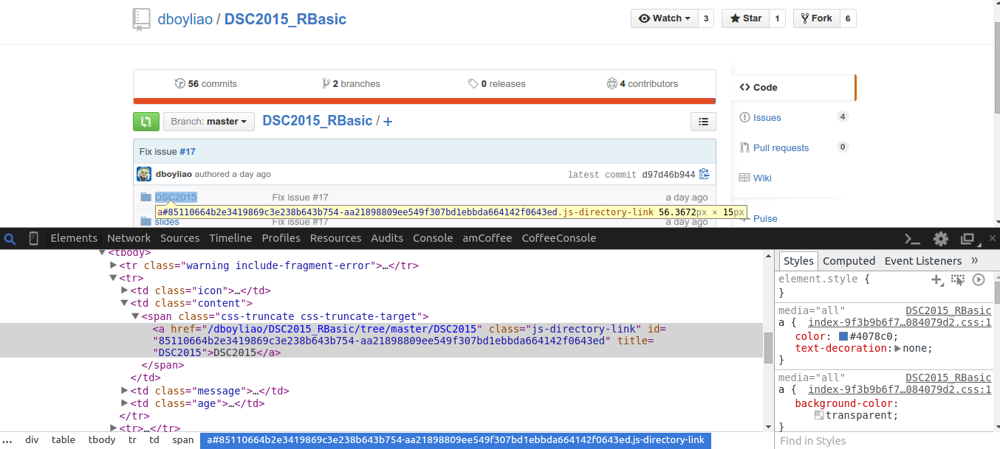

## 什麼是爬蟲

- 利用程式有系統地造訪網頁，取得網頁內容。取出有用的資料以利後續應用。

> - 翻譯：把別人家的資料當成你家的資料用。


## 爬蟲流程

- 觀察網頁
- 造訪網頁取得內容
- 剖析資料
- 儲存資料


# 實作方式

## 觀察網頁


## 檢查網頁元素



## 造訪網頁取得內容

使用[httr](https://cran.r-project.org/web/packages/httr/httr.pdf)套件

```{r}
library(httr)
url = "https://github.com/dboyliao/DSC2015_RBasic"
response = GET(url)
content = content(response)
capture.output(content)[1:5] # Capture first 20 lines of output
```


## 剖析資料
針對不同資料格式要選不一樣的剖析套件。以html檔案為例，使用CSS選擇器來剖析。

```{r}
library(XML)
library(selectr)
nodes = querySelectorAll(content,".files .content a")
nodes
```

## 取出字串

```{r}
xmlValue(nodes[[1]])
```


# 範例欣賞

## 新北市消防局API [http://hackersome.com/p/faryne/ntpcfd-stats](http://hackersome.com/p/faryne/ntpcfd-stats)

- API Endpoint：http://ha2.tw/ntpcfd/api/json
    - Request Type：GET
    - Response Type：JSON
- 所需參數：
    - service_time：[可選參數]出勤日期，格式為 YYYY-mm-dd
    - service_unit[]：[可選參數]出勤分隊，例如 樹林分隊 、 板橋分隊
    - service_type[]：[可選參數]出勤任務類型，目前只能輸入 救護、火災 、 災害

## 新北市消防局

- 回傳結果：
    - service_type：出勤任務類型
    - service_unit：出勤分隊
    - service_addr：出勤地址
    - service_time：報案時間
    - lat：出勤地址約略緯度
    - lng：出勤地址約略經度
- 備註：若不帶入任何參數，則取出當天所有報案紀錄。
- 資料來源：http://epaper.tpf.gov.tw/liveview/default.asp

## 造訪網頁取得內容 + 剖析資料

```{r ntpcfd_api, message=FALSE}
library(jsonlite)
library(knitr)

url = "http://ha2.tw/ntpcfd/api/json?service_time=2015-07-25"
data = jsonlite::fromJSON(url)
kable(head(data))
```

## 檢視資料

```{r}
kable(summary(data), align = "l")
```

## 預處理

```{r preprocessing}
data$service_type = as.factor(data$service_type)
data$service_unit = as.factor(data$service_unit)
data$lat = as.numeric(data$lat)
data$lng = as.numeric(data$lng)
dataWithGeoPoint = data[ data$lng>0, ]
kable(summary(dataWithGeoPoint), align = "l")
```

## 簡單視覺化

```{r cache=TRUE,message=FALSE,fig.width=10, visualization }
library(ggplot2)
library(ggmap)

box = make_bbox(dataWithGeoPoint$lng, dataWithGeoPoint$lat) 
p = ggmap(get_map(box, maptype = "toner", zoom = 11)) 
q = p + geom_point(data=dataWithGeoPoint, aes(lng, lat, colour="red" ), size =3)+ theme(legend.position="none")
q
```

